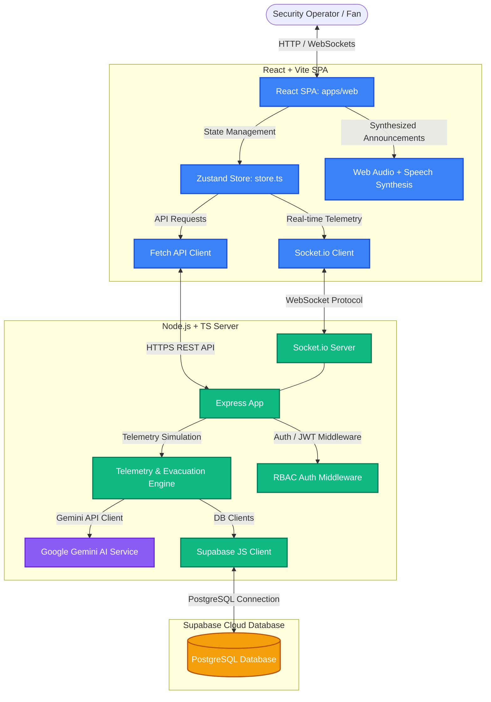

# CrowdShield AI — Smart Stadium Operating System & Crowd Intelligence Platform

## Overview
**CrowdShield AI** is an enterprise-grade, real-time stadium operations and crowd intelligence system tailored for high-capacity venue management (e.g., a 95k+ capacity IPL cricket match at Chinnaswamy Stadium, featuring RCB vs CSK).

The platform uses live telemetry, dynamic AI-driven spectator routing, automated emergency orchestration, and comprehensive analytics to mitigate bottlenecks, counter ticket fraud, and streamline stadium egress and ingress.

The project is structured as a **npm workspace monorepo**:
1. **`backend/`** – A Node.js + TypeScript server utilizing Express, Socket.IO, and the Supabase JS Client to manage real-time simulation, incident workflows, and AI support.
2. **`apps/web/`** – A React + Vite SPA using Zustand, Tailwind CSS, and Framer Motion to visualize stadium state, gate throughput, and analytics.

---

## System Architecture



### Module Breakdown

#### Backend Server (`backend/src/index.ts`)
- **Real-Time Simulation**: Runs a telemetry engine updating occupant density, gate flow rates, and incident states every 2 seconds.
- **WebSocket Streaming**: Dispatches live updates (`telemetry_update`, `alert_broadcast`) to connected operators.
- **Security & RBAC**: Implements JWT authentication and Role-Based Access Control (`viewer`, `operator`, `admin`) to restrict critical functions like triggering evacuation sirens.
- **Static Hosting**: Configured to build and serve the React frontend assets dynamically, enabling single-container deployments on Cloud Run.

#### Frontend Dashboard (`apps/web/`)
- **Digital Twin map**: Renders a dynamic vector map of the cricket stands (Zones A-D) with color-coded congestion levels.
- **Sound Design & Chimes**: Integrates ambient crowd noise, gate scanning audio chimes, incident alerts, and evacuation sirens.
- **Voice Overrides**: Allows operator voice commands (via Speech Recognition) to trigger gate changes or emergencies.
- **Ticket Scanner**: Simulates barcode scanning to stress-test throughput and catch duplicate/counterfeit tickets.

---

## Installation & Setup

### Prerequisites
- **Node.js** (v18 or higher)
- **npm** (v9 or higher)

### Setup Steps

1. **Clone the repository** and navigate to the project directory:
   ```bash
   git clone https://github.com/Abb2907/crowdshield.git
   cd apl_finale_project
   ```

2. **Install all monorepo dependencies**:
   ```bash
   npm run install:all
   ```

3. **Configure Environment Variables** (create a `.env` file in the `backend/` directory):
   ```env
   PORT=8080
   JWT_SECRET=your-secure-jwt-secret
   SUPABASE_URL=https://your-supabase-project.supabase.co
   SUPABASE_ANON_KEY=your-supabase-anon-key
   GEMINI_API_KEY=your-google-gemini-api-key
   ```
   *Note: If Supabase or Gemini variables are missing, the server will degrade gracefully to mock data and static briefings.*

---

## Running the Application

### Local Development Mode
Start backend and web dev servers concurrently in separate terminals:
```bash
# Terminal 1: Start Backend (Default: http://localhost:4000)
npm run dev:backend

# Terminal 2: Start Vite Frontend (Default: http://localhost:5173)
npm run dev:web
```

### Production Build & Launch
Build the React frontend assets, compile TypeScript, and boot the Express production server:
```bash
# Compile and package everything
npm run build

# Start the Node.js server
npm start
```
The server will start listening on your defined `PORT` (or default `8080`) and serve the React dashboard at the root URL (`/`).

---

## Cloud Run Deployment

To deploy this monorepo to **Google Cloud Run**, ensure your code is pushed to your Git repository, then run:
```bash
gcloud run deploy crowdshield \
  --source . \
  --platform managed \
  --allow-unauthenticated \
  --set-env-vars="SUPABASE_URL=...,SUPABASE_ANON_KEY=...,GEMINI_API_KEY=..."
```
The platform automatically uses the `Procfile` to run `npm run build && node backend/dist/index.js` to compile resources and spin up the production server.
